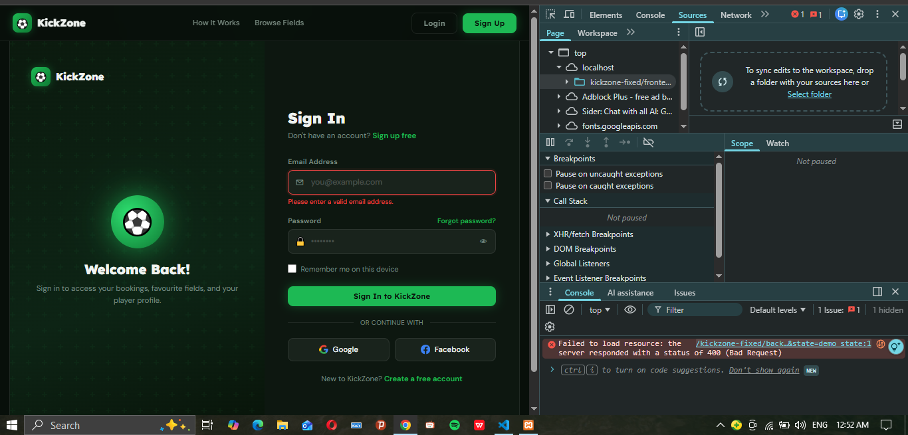

# Login Debugging Guide

## Issues Fixed

1. **Better error logging** - Frontend now logs all requests and responses to console
2. **CORS preflight support** - Backend now handles OPTIONS requests
3. **Response validation** - Frontend checks HTTP status before parsing JSON
4. **Detailed error messages** - Both frontend and backend log errors for debugging

## Testing the Login

### Step 1: Ensure XAMPP is Running
- Start Apache and MySQL from XAMPP Control Panel
- Verify MySQL is running (database must be accessible)

### Step 2: Create a Test User
Visit: `http://localhost/kickzone-fixed/frontend/pages/signup/index.html`
- Fill in the signup form with test credentials
- Email: `test@example.com`
- Password: `password123` (must be 6+ characters)
- Submit the form

### Step 3: Open Browser Console
- Press `F12` or right-click → Inspect
- Go to the **Console** tab

### Step 4: Attempt Login
Visit: `http://localhost/kickzone-fixed/frontend/pages/login/index.html`
- Email: `test@example.com`
- Password: `password123`
- Click "Sign In to KickZone"
- Watch the console for output

## What to Look For in Console

**Successful login output:**
```
Sending login request...
Response status: 200
Raw response: {"success":true,"message":"Login successful.","user":{...}}
Parsed data: {success: true, ...}
Login successful, saving user...
```

**Common errors:**

### Error: "HTTP 404"
- **Cause**: Backend file not found
- **Solution**: Check that backend/login.php exists

### Error: "Incorrect email or password"
- **Cause**: User account doesn't exist or wrong password
- **Solution**: Register a new test account first

### Error: "Cannot reach server"
- **Cause**: XAMPP not running or wrong URL
- **Solution**: 
  1. Start XAMPP MySQL and Apache
  2. Test database connection by visiting browse page

### Error: "JSON.parse" error
- **Cause**: Backend returned non-JSON response
- **Solution**: Check error_log in XAMPP (xampp/apache/logs/error.log)

## Database Test Query

If backend isn't connecting, verify database:
1. Open phpMyAdmin: `http://localhost/phpmyadmin`
2. Check if database `kickzone` exists
3. Run setup.sql if needed
4. Verify `users` table has records

## PHP Error Log Location

Check XAMPP error log for backend errors:
```
C:\xampp\apache\logs\error.log
```

## Next Steps if Still Broken

1. Check browser console for errors (F12)
2. Check phpMyAdmin to verify database and users table
3. Verify registration is creating users in database
4. Check XAMPP error log for PHP errors
5. Verify the database credentials in backend/db_connect.php
